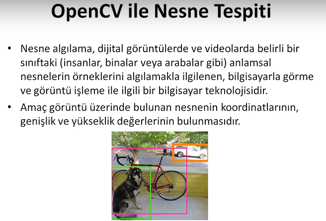

# Object Detection with OpenCV

[Buraya tıklayarak Notion sayfamdan notları daha düzenli inceleyebilirsiniz.](https://recepaydogdu.notion.site/Object-Detection-with-OpenCV-102a12f84a0b4122a0bc3d1da30bc48c)

[Kullanılan kaynaklar için tıklayınız.](kaynaklar.md)

## Nesne Tespiti Nedir?




## Kenar Algılama (Edge Detection)


```python
import cv2
import matplotlib.pyplot as plt
import numpy as np

#gorsellestirme fonksiyonu
def imshow_img(img, title):
    plt.figure(), plt.imshow(img, cmap="gray"), plt.title(title)

img = cv2.imread("1_edge_detection/london.jpg", 0)
imshow_img(img, "original")

edges = cv2.Canny(image=img, threshold1=0, threshold2=255)
imshow_img(edges, "edges")

plt.show()
```


Kenarları elde ettik fakat kenar olmayan su gibi yapılar da algılandı. Çünkü herhangi bir threshold kullanmadık.

**Threshold Güncelleme**

Threshold belirlenirken en mantıklı yöntemler median ve mean yöntemleridir. Mean bazen resmin skalasına göre değişiklik gösterebilir. Median ile threshold belirleyelim;

```python
med_val = np.median(img)
print(med_val)
```

Medyan değerini 140 olarak tespit ettik. Ortalaması ise 127 idi. İkisi de kullanılabilir. Median ile devam edelim.

Alt ve üst threshold belirlenirken literatürde bir formül var;

```python
low = int(max(0, (1-0.33)*med_val)) # =85
high = int(min(255, (1+0.33)*med_val)) # =169
```

```python
edges_th = cv2.Canny(image=img, threshold1=low, threshold2=high)
imshow_img(edges_th, "edges_th (85, 169)")
```

Az da olsa değişiklikler oldu;


Sonuçları iyileştirmek için tüm resme ya da sadece suyun olduğu bölüme blurring uygulayabiliriz. Tüm resme uygulayalım;

```python
# blur
blurred_img = cv2.blur(img, ksize=(7,7))
imshow_img(blurred_img, "blurred img")
```


Bulanık görüntü ile yeniden medyan hesaplayalım ve kenar tespiti yapalım;

```python
med_val = np.median(blurred_img)
print(med_val)

low = int(max(0, (1-0.33)*med_val)) # =85
high = int(min(255, (1+0.33)*med_val)) # =169

edges_th = cv2.Canny(image=blurred_img, threshold1=low, threshold2=high)
imshow_img(edges_th, "edges_th - blurred (85, 169)")

plt.show()
```


## Köşe Algılama (Corner Detection)


### Harris Corner Detection

```python
import cv2
import matplotlib.pyplot as plt
import numpy as np

#gorsellestirme fonksiyonu
def imshow_img(img, title):
    plt.figure(), plt.imshow(img, cmap="gray"), plt.title(title)

img = cv2.imread("2_corner_detection/sudoku.jpg", 0)
img = np.float32(img) #ondalikli sayilara cevirme
print(img.shape)
imshow_img(img, "original")

#harris corner detection
dst = cv2.cornerHarris(img, blockSize=2, ksize=3, k=0.04)
imshow_img(dst, "cornerHarris")

plt.show()
```


Harris Corner yöntemi ile köşeleri tespit edebiliyoruz fakat daha belirgin olması için `dilate` yöntemi ile tespit edilen köşeleri genişletelim;

```python
#dilate yontemi ile tespit edilen noktalari genisletme
dst = cv2.dilate(dst, None)
img[dst>0.2*dst.max()] = 1 

imshow_img(dst, "cornerHarris")
```


### Shi Tomasi Algoritması

```python
# shi tomasi detection
img = cv2.imread("2_corner_detection/sudoku.jpg", 0)
img = np.float32(img) #ondalikli sayilara cevirme

corners = cv2.goodFeaturesToTrack(img,
                                    120, #istenilen corner sayisi
                                    0.01, #quality level
                                    10)  #iki kose arasindaki min distance

corners = np.int64(corners)

for i in corners:
    x,y = i.ravel() #duzlestirme
    cv2.circle(img, (x,y),3,(125,125,125), cv2.FILLED)

plt.figure(),plt.imshow(img)
```


### Kontur Algılama (Contour Detection)


```python
import cv2
import matplotlib.pyplot as plt
import numpy as np

#gorsellestirme fonksiyonu
def imshow_img(img, title):
    plt.figure(), plt.imshow(img, cmap="gray"), plt.title(title)

img = cv2.imread("3_contour_detection/contour.jpg", 0)
imshow_img(img, "original")

contours, hierarch = cv2.findContours(img,
                                            cv2.RETR_CCOMP, #internal ve external contourler
                                            cv2.CHAIN_APPROX_SIMPLE) #yatay dikey ve capraz bolumleri sıkıstırır,
                                                                    #yanlizca uc noktalarini birakiyor

external_contour = np.zeros(img.shape)
internal_contour = np.zeros(img.shape)

for i in range(len(contours)):
    #external
    if hierarch[0][i][3] == -1:
        cv2.drawContours(external_contour,contours,i,255,-1)
    else:
        cv2.drawContours(internal_contour,contours,i,255,-1)

imshow_img(external_contour, "external contours")  
imshow_img(internal_contour, "internal contours")        
plt.show()
```


## Renk ile Nesne Tespiti


Mavi renk tespiti yapabilmemiz için mavi renk tonlarını HSV olarak belirlememiz gerekiyor.

Paint programından görüldüğü gibi 85-179 aralığı mavi tonlarını oluşturmaktadır. Parlaklık ve doygunluk parametrelerini de buna göre ayarlayacağız.


```python
#mavi renk aralığı - HSV
blueLower = (84, 98, 0)
blueUpper = (179, 255, 255)
```

HSV formatında kameradan görüntü okuma;

```python
import cv2, numpy as np
from collections import deque

#nesne merkezini depolayacak veri tipi
buffer_size = 16 #deque boyutu
pts = deque(maxlen=buffer_size)

#mavi renk aralığı - HSV
blueLower = (84, 98, 0)
blueUpper = (179, 255, 255)

#capture
cap = cv2.VideoCapture(0)
cap.set(3, 960) #width
cap.set(4, 480) #height

while True:
    success, imgOriginal = cap.read()
    
    if success:
        #detayi azaltip noise azaltma
        blurred = cv2.GaussianBlur(imgOriginal, (11,11), 0)

        #hsv
        hsv = cv2.cvtColor(blurred, cv2.COLOR_BGR2HSV)

        cv2.imshow("HSV Image", hsv)
        if cv2.waitKey(1) & 0xFF == ord("q"): 
            cv2.destroyAllWindows()
            break
```


Mavi renk için maske;

```python
#mavi icin maske
        mask = cv2.inRange(hsv, blueLower, blueUpper)
        cv2.imshow("mask Image", mask)
```


Mavi renkli cisimleri tespit edebiliyor fakat etrafta noise oluşumu var.

Noise'lardan kurtulmak için `Erode` ve `Dilate` yöntemlerini uygulayacağız;

```python
#maskenin etrafinda kalan gurultuleri sil
        mask = cv2.erode(mask, None, iterations=2)
        mask = cv2.dilate(mask, None, iterations=2)
        cv2.imshow("mask+erode-dilate", mask)
```


Tüm uygulama;

```python
import cv2, numpy as np
from collections import deque

#nesne merkezini depolayacak veri tipi
buffer_size = 16 #deque boyutu
pts = deque(maxlen=buffer_size)

#mavi renk aralığı - HSV
blueLower = (84, 98, 0)
blueUpper = (179, 255, 255)

#capture
cap = cv2.VideoCapture(0)
cap.set(3, 480) #width
cap.set(4, 320) #height

while True:
    success, imgOriginal = cap.read()
    
    if success:
        #detayi azaltip noise azaltma
        blurred = cv2.GaussianBlur(imgOriginal, (11,11), 0)

        #hsv
        hsv = cv2.cvtColor(blurred, cv2.COLOR_BGR2HSV)

        cv2.imshow("HSV Image", hsv)

        #mavi icin maske
        mask = cv2.inRange(hsv, blueLower, blueUpper)
        cv2.imshow("mask Image", mask)

        #maskenin etrafinda kalan gurultuleri sil
        mask = cv2.erode(mask, None, iterations=1)
        mask = cv2.dilate(mask, None, iterations=1)
        cv2.imshow("mask+erode-dilate", mask)

        #contour
        (contours,_) = cv2.findContours(mask.copy(), cv2.RETR_EXTERNAL, cv2.CHAIN_APPROX_SIMPLE)

        center=None

        if len(contours)>0:
            #en buyuk konturu al
            c = max(contours, key=cv2.contourArea)

            #dikdortgene cevir
            rect = cv2.minAreaRect(c)
            ((x,y), (width,height), rotation) = rect

            s = "x: {}, y: {}, width: {}, height: {}, rotation: {}".format(np.round(x),
                                                                           np.round(y),
                                                                           np.round(width),
                                                                           np.round(height),
                                                                           np.round(rotation))
            
            print(s)

            box = cv2.boxPoints(rect)
            box = np.uint64(box)

            # moment - goruntunun merkezini bulmamiza yarayan yapi
            M = cv2.moments(c)
            center = (int(M["m10"]/M["m00"]),
                      int(M["m01"]/M["m00"]))

            #contour'u cizdir
            cv2.drawContours(imgOriginal, [box], 0, (0,255,255),2)

            #merkeze nokta ciz
            cv2.circle(imgOriginal, center, 5, (255,0,255), -1)

            #bilgileri ekrana yazdir
            cv2.putText(imgOriginal, s, (20,20), cv2.FONT_HERSHEY_COMPLEX_SMALL, 0.4, (0,0,0), 1)

        # deque (nokta takip)
        pts.appendleft(center)
        for i in range(1, len(pts)):
            if pts[i-1] is None or pts[i] is None: continue
            cv2.line(imgOriginal, pts[i-1], pts[i], (0,255,0),3)
        
        cv2.imshow("Orjinal Tespit", imgOriginal)

        if cv2.waitKey(1) & 0xFF == ord("q"): 
            cv2.destroyAllWindows()
            break
```


## Şablon Eşleme (Template Matching)


```python
import cv2
import matplotlib.pyplot as plt

# template matching
img = cv2.imread("5_template_matching/cat.jpg", 0)
print(img.shape)

template = cv2.imread("5_template_matching/cat_face.jpg", 0)
print(template.shape)

h, w = template.shape

methods = ['cv2.TM_CCOEFF', 'cv2.TM_CCOEFF_NORMED', 'cv2.TM_CCORR',
            'cv2.TM_CCORR_NORMED', 'cv2.TM_SQDIFF', 'cv2.TM_SQDIFF_NORMED']

for meth in methods:
    method = eval(meth) # 'cv2.TM_CCOEFF' -> cv2.TM_CCOEFF

    res = cv2.matchTemplate(img, template, method)
    print(res.shape)
    min_val, max_val, min_loc, max_loc=cv2.minMaxLoc(res)

    if method in [cv2.TM_SQDIFF, cv2.TM_SQDIFF_NORMED]:
        top_left = min_loc
    else:
        top_left = max_loc
        
    bottom_right = (top_left[0] + w, top_left[1] + h)
    
    cv2.rectangle(img, top_left, bottom_right, 255, 2)
    
    plt.figure()
    plt.subplot(121), plt.imshow(res, cmap = "gray")
    plt.title("Eşleşen Sonuç"), plt.axis("off")
    plt.subplot(122), plt.imshow(img, cmap = "gray")
    plt.title("Tespit edilen Sonuç"), plt.axis("off")
    plt.suptitle(meth)
    
    plt.show()
```


## Özellik Eşleştirme (Feature Matching)


### ORB Tanımlayıcısı

```python
import cv2
import matplotlib.pyplot as plt

#gorsellestirme fonksiyonu
def imshow_img(img, title):
    plt.figure(), plt.imshow(img, cmap="gray"), plt.title(title)

chos = cv2.imread("6_feature_matching/chocolates.jpg", 0)
imshow_img(chos, "Chocolates")

cho = cv2.imread("6_feature_matching/nestle.jpg", 0)
imshow_img(cho, "nestle")

### Tanimlayicilar

# orb tanimlayicisi
# kose-kenar gibi nesneye ait ozellikler

orb = cv2.ORB_create()

# anahtar nokta tespiti
kp1, des1 = orb.detectAndCompute(cho, None)
kp2, des2 = orb.detectAndCompute(chos, None)

# brute-force matcher
bf = cv2.BFMatcher(cv2.NORM_HAMMING)

# noktalari eslestir
matches = bf.match(des1, des2)

# mesafeye gore sirala
matches = sorted(matches, key=lambda x: x.distance)

# eslesen resimleri goster

img_match = cv2.drawMatches(cho, kp1, chos, kp2, matches[:20], None, flags=2)
imshow_img(img_match, "match")

plt.show()
```

ORB tanımlayıcısı rotasyon farkları olduğu için görüntülerimizde iyi sonuç vermedi.


### Sift Tanımlayıcısı

opencv sürümünden kaynaklı olarak çalışmayabilir.

```python
# sift
sift = cv2.xfeatures2d.SIFT_create()

# bf
bf = cv2.BFMatcher()

# anahtar nokta tespiti sift ile
kp1, des1 = sift.detectAndCompute(cho, None)
kp2, des2 = sift.detectAndCompute(chos, None)

matches = bf.knnMatch(des1, des2, k = 2)

guzel_eslesme = []

for match1, match2 in matches:
    
    if match1.distance < 0.75*match2.distance:
        guzel_eslesme.append([match1])
    

sift_matches = cv2.drawMatchesKnn(cho,kp1,chos,kp2,guzel_eslesme,None, flags = 2)
imshow_img(sift_matches, "sift")
```


## Havza Algoritması (Watershed)


```python
import cv2
import matplotlib.pyplot as plt
import numpy as np

#gorsellestirme fonksiyonu
def imshow_img(img, title):
    plt.figure(), plt.imshow(img, cmap="gray"), plt.title(title)

coin = cv2.imread("7_watershed\coins.jpg", 0)
imshow_img(coin, "original")

plt.show()
```


Paraların detaylarına ihtiyacımız yok. Low pass filter uygulayarak detayları azaltalım;

```python
#Low pass filter: Blurring
coin_blur = cv2.medianBlur(coin, ksize=13)
imshow_img(coin_blur, "coin_blur")
```


Binary Threshold yöntemi ile arka plan ile paralar arasındaki farkı daha çok açalım.

```python
# binary threshold
ret, coin_thresh = cv2.threshold(coin_blur, 75, 255, cv2.THRESH_BINARY)
imshow_img(coin_thresh, "binary threshold w blur")

ret, coin_thresh = cv2.threshold(coin, 75, 255, cv2.THRESH_BINARY)
imshow_img(coin_thresh, "binary threshold")
```


Contour işlemi;

```python
# contour
contours, hierarchy = cv2.findContours(coin_thresh.copy(), cv2.RETR_CCOMP, cv2.CHAIN_APPROX_SIMPLE)

for i in range(len(contours)):
    if hierarchy[0][i][3] == -1: #external
        cv2.drawContours(coin_color, contours, i, (0,255,0), 10)
plt.figure(), plt.imshow(coin_color), plt.title("contours")
plt.show()
```


Contour çizimi gerçekleşti fakat görüldüğü gibi paraların sınırları tam olarak ayrılamadı.

Aşağıda görüldüğü gibi paralar arasında köprüler oluşmuş;


Bu durumu düzeltmek için morfolojik operasyonlar ile ilk olarak nesnelerin boyutunu küçültürsek aradaki köprüler kopacaktır. Sonrasında yeniden genişletebiliriz.

Havza algoritması;

```python
### WATERSHED

coin_color = cv2.imread("7_watershed\coins.jpg")
coin = cv2.cvtColor(coin_color, cv2.COLOR_BGR2GRAY)
#imshow_img(coin, "original")

#Low pass filter: Blurring
coin_blur = cv2.medianBlur(coin, ksize=13)
# imshow_img(coin_blur, "coin_blur")

# binary threshold
ret, coin_thresh = cv2.threshold(coin_blur, 75, 255, cv2.THRESH_BINARY)
imshow_img(coin_thresh, "binary threshold w blur 90")

ret, coin_thresh_not_blur = cv2.threshold(coin, 75, 255, cv2.THRESH_BINARY)
# imshow_img(coin_thresh_not_blur, "binary threshold")

# opening
kernel = np.ones((3,3), np.uint8)
opening = cv2.morphologyEx(coin_thresh, cv2.MORPH_OPEN, kernel, iterations=2)
imshow_img(opening, "opening")

# nesneler arasi distance bulma
dist_transform = cv2.distanceTransform(opening, cv2.DIST_L2, 5)
imshow_img(dist_transform, "dist_transform")

#resmi kucult
ret, sure_foreground = cv2.threshold(dist_transform, 0.4*np.max(dist_transform),255,0)
sure_foreground = np.uint8(sure_foreground)
imshow_img(sure_foreground, "kucultme")

#arka plan icin resmi buyut
sure_background = cv2.dilate(opening, kernel, iterations=1)
sure_background = np.uint8(sure_background)

#arkaplan-onplan arasindaki fark
unknown = cv2.subtract(sure_background, sure_foreground)
imshow_img(unknown, "unknown")

# baglanti
ret, marker = cv2.connectedComponents(sure_foreground)
marker = marker + 1
marker[unknown==255] = 0
imshow_img(marker, "marker")

plt.show()
```


## Yüz Tanıma Projesi


```python
import cv2
import matplotlib.pyplot as plt

# içe aktar
einstein = cv2.imread("einstein.jpg", 0)
plt.figure(), plt.imshow(einstein, cmap="gray"), plt.axis("off")

# sınıflandırıcı
face_cascade = cv2.CascadeClassifier("haarcascade_frontalface_default.xml")

face_rect = face_cascade.detectMultiScale(einstein)

for (x, y, w, h) in face_rect:
    cv2.rectangle(einstein, (x, y), (x + w, y + h), (255, 255, 255), 10)
plt.figure(), plt.imshow(einstein, cmap="gray"), plt.axis("off")

# barce
# içe aktar
barce = cv2.imread("barcelona.jpg", 0)
plt.figure(), plt.imshow(barce, cmap="gray"), plt.axis("off")

face_rect = face_cascade.detectMultiScale(barce, minNeighbors=30)
# Daha basarili sonuclar elde etmek icin detectMultiScale'in bazi parametrelerini degistirebiliriz.
# minNeighbors parametresi tespit edilen bolgede yan yana min kac kutunun kabul edilecegini belirler.

for (x, y, w, h) in face_rect:
    cv2.rectangle(barce, (x, y), (x + w, y + h), (255, 255, 255), 10)
plt.figure(), plt.imshow(barce, cmap="gray"), plt.axis("off")
plt.show()

# video
cap = cv2.VideoCapture(0)

while True:

    ret, frame = cap.read()

    if ret:

        face_rect = face_cascade.detectMultiScale(frame, minNeighbors=20)

        for (x, y, w, h) in face_rect:
            cv2.rectangle(frame, (x, y), (x + w, y + h), (255, 255, 255), 10)
        cv2.imshow("face detect", frame)

    if cv2.waitKey(1) & 0xFF == ord("q"): break

cap.release()
cv2.destroyAllWindows()
```

## Kedi Yüzü Tanıma Projesi

```python
import cv2
import os

files = os.listdir()
print(files)
img_path_list = []
for f in files:
    if f.endswith(".jpg"): 
        img_path_list.append(f)
print(img_path_list)

for j in img_path_list:
    print(j)
    image = cv2.imread(j)
    gray = cv2.cvtColor(image, cv2.COLOR_BGR2GRAY)
    
    detector = cv2.CascadeClassifier("haarcascade_frontalcatface.xml")
    rects = detector.detectMultiScale(gray, scaleFactor = 1.045, minNeighbors = 2)
    
    for (i, (x,y,w,h)) in enumerate(rects):
        cv2.rectangle(image, (x,y), (x+w, y+h),(0,255,255),2)
        cv2.putText(image, "Kedi {}".format(i+1), (x,y-10),cv2.FONT_HERSHEY_SIMPLEX, 0.55, (0,255,255),2)
        
    cv2.imshow(j, image)
    if cv2.waitKey(0) & 0xFF == ord("q"): continue
```


## Özel Benzer Özellikler ile Nesne Algılama


**Yapacağımız işlemler;**

1- Veriseti oluştur.

- Verisetinin içinde negatif ve pozitif görüntüler olacak.
    - Pozitif: Tespit etmek istediğimiz objeyi içeren görüntüler.
    - Negatif: Tespit edilecek objeyi içermeyen görüntüler.

2- Cascade programı indirilecek.

3- Cascade oluşturulacak.

4- Cascade ile tespit algoritması yazılacak.

### 1- Veriseti Oluşturma

Aşağıdaki kod bloğu ile iki ayrı klasör oluşturup birisine pozitif verileri diğerine de negatif verileri kaydettik.

```python
import cv2
import os

# Veriseti depo klasoru
path = "images"

# Goruntu boyutu
imgWidth = 180 #Genislik
imgHeight = 120 #Yukseklik

#Video capture
cap = cv2.VideoCapture(4)

cap.set(3, 640) #Width
cap.set(4, 480) #Height
cap.set(10, 180) #Brightness

global countFolder
def saveDataFunc():
    global countFolder
    countFolder = 0

    while os.path.exists(path + str(countFolder)):
        countFolder += 1
    os.makedirs(path + str(countFolder))
    
saveDataFunc()

count = 0     # 5 frame'de bir frame kontrolu icin
countSave = 0 # frame'lerin ismi icin

while True:
    success, img = cap.read()
    
    if success:
        img = cv2.resize(img, (imgWidth, imgHeight))
        
        #Her frame'i almaya gerek olmadigi icin 5'in katlarina denk gelen frame'ler alinacak.
        if count%5==0:
            cv2.imwrite(path + str(countFolder) + "/" + str(countSave) + "_.png", img)
            countSave += 1
            print(path + str(countFolder) + "/" + str(countSave) + "_.png")
        
        count += 1
    
        cv2.imshow("Image", img)
    
    if cv2.waitKey(1) & 0xFF == ord("q"): break

cap.release()
cv2.destroyAllWindows()
```

159 pozitif ve 180 negatif görüntü verisi kaydedildi.

Pozifit görüntü örnekleri;


Negatif görüntü örnekleri;


### 2- Cascade Trainer GUI

[Cascade Trainer GUI - Amin](https://amin-ahmadi.com/cascade-trainer-gui/)

Yukarıdaki linkten Cascade Trainer GUI programını indireceğiz.

Cascade Trainer GUI, kademeli sınıflandırıcı modellerini eğitmek, test etmek ve geliştirmek için kullanılabilen bir programdır. Parametreleri ayarlamak için bir grafik arayüz kullanır ve sınıflandırıcıları eğitmek ve test etmek için OpenCV araçlarını kullanmayı kolaylaştırır.

Cascade Trainer GUI ile eğitim sonucunda elde edilen `cascade.xml` dosyasını tespit algoritması bölümünde kullanacağız.

### 3- Cascade ile Tespit Algoritması

Aşağıdaki kod bloğu ile önceki adımda oluşturduğumuz cascade dosyasını kullanarak tespit algoritmasını oluşturduk.

```python
import cv2

path = "classifier/cascade.xml"
objectName = "Mint"
frameWidth = 280
frameHeight = 360
color = (255,0,255)

cap = cv2.VideoCapture(0)
cap.set(3, frameWidth)
cap.set(4, frameHeight)

# trackbar
cv2.namedWindow("Sonuc")
cv2.resizeWindow("Sonuc", frameWidth, frameHeight + 100)

# trackbar'lar icin bos fonksiyon
def empty(a): pass

#detectMultiscale fonksiyonu icerisindeki scale degerini degistirir.
cv2.createTrackbar("Scale","Sonuc", 500, 1000, empty)

cv2.createTrackbar("Neighbor","Sonuc", 4, 50, empty)

# cascade classifier
cascade = cv2.CascadeClassifier(path)

while True:
    success, img = cap.read()
    
    if success:
        gray = cv2.cvtColor(img, cv2.COLOR_BGR2GRAY)
        
        # Detection parametreleri
        # scale normalde 1-2 arasinda olur fakat rahat hareket ettirebilmek icin boyle yaptik.
        scaleVal = 1 + (cv2.getTrackbarPos("Scale", "Sonuc") / 1000)
        
        neighbor = cv2.getTrackbarPos("Neighbor", "Sonuc")
        
        # detection
        rects = cascade.detectMultiScale(gray, scaleVal, neighbor)
        
        for (x, y, w, h) in rects:
            cv2.rectangle(img, (x,y), (x+w, y+h), color, 3)
            cv2.putText(img, objectName, (x, y-5), cv2.FONT_HERSHEY_COMPLEX_SMALL, 1, color, 2)
        
        cv2.imshow("Sonuc", img)
        
    if cv2.waitKey(1) & 0xFF == ord("q"): break

cap.release()
cv2.destroyAllWindows()
```

